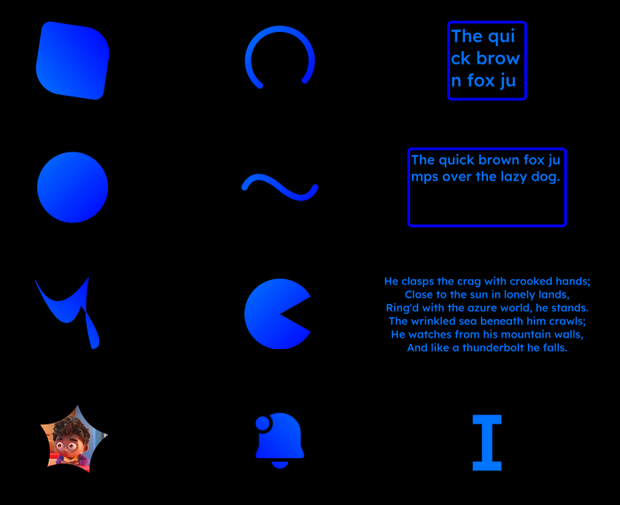

## What is this?
An immediate-mode 2D signed-distance-field renderer built on WGPU.  It's quite young and built very specifically for my needs at the moment, but might turn into something useful to more people.

Things you can expect to find:
- Shapes of various kinds
- Scissors of any shape (stencils)
- Shape combinations like union, intersect, subtract and xor
- Matrix transforms
- Fill/stroke with gradients or solid colors
- Both immediate and baked text with wrapping and justify.  Text is rendered with multi-channel signed distance fields which look sharp at any rotation/scale.

Things I will get done eventually include proper custom texture binding and image loading.  The capability is already there, but not really well exposed to the developer.
